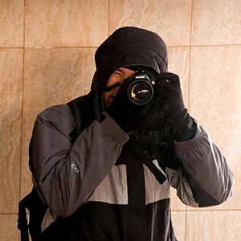

#Обо мне

Привет меня зовут Денис! 

Я веб-дизайнер и работаю на платформе ***Тильда***.

Я разрабатываю сайты на Тильде уже более 7 лет и знаю все об этой платформе. Мой подход — делать каждый сайт как для себя. Важно чтобы сайт был не просто красивым, но и приносил пользу бизнесу. Заказывая сайт у меня, вы получаете продуманный уникальный дизайн и удобную мобильную версию, а не просто адаптив.

Оставьте заявку и я сориентирую вас по цене и срокам. Подробно опишите ваши пожелания, приведите примеры. Ведь чем подробнее ТЗ, тем точнее будет исполнение.

